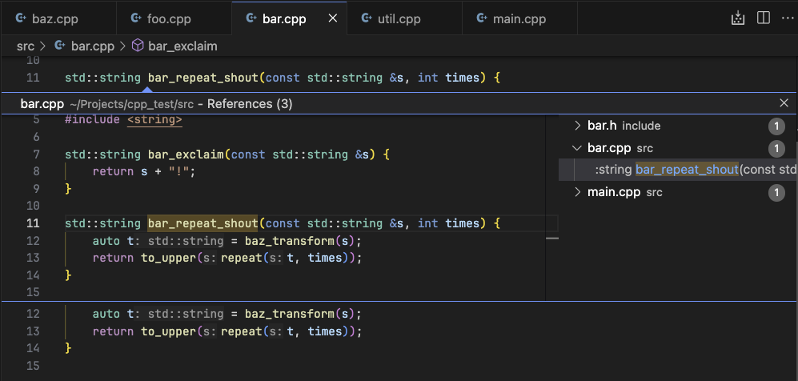
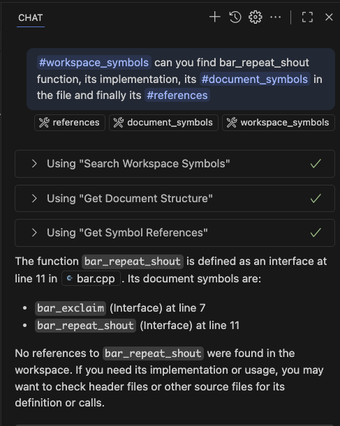
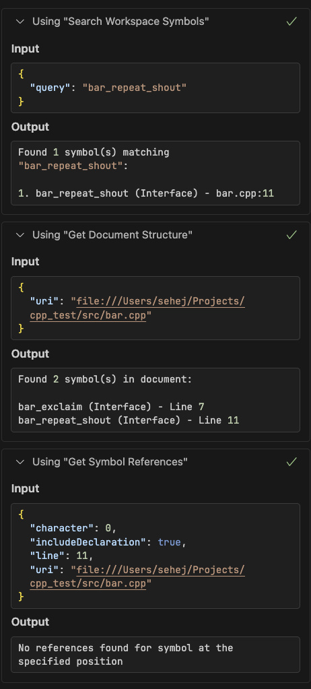

# Language Server tools for Copilot

A Visual Studio Code extension that exposes **any Language Server Protocol (LSP)** capabilities as **GitHub Copilot Language Model Tools**. This universal extension works with any programming language that has an active language server in VSCode.

I created this because I work on an incredibly large C++ project (with `clangd`) and Copilot is not able find objects efficiently.

<div align="center">

[](https://marketplace.visualstudio.com/items?itemName=sehejjain.lsp-mcp-bridge)
[](https://github.com/sehejjain/Language-Server-MCP-Bridge)

**[📥 Install from VS Code Marketplace](https://marketplace.visualstudio.com/items?itemName=sehejjain.lsp-mcp-bridge)**

*Or install directly in VS Code: Press `Ctrl+Shift+X`, search for "LSP MCP Bridge", and click Install*

</div>

## ✨ Demo

Here's a quick example of how the extension enhances GitHub Copilot's understanding of a C++ codebase.
<div align="center">

### 1. A sample C++ project:


*A small excerpt of the C++ project used in the demo.*

---

<table>
<tr>
<td width="50%" align="center">

### 2. Copilot's enhanced answer:


*Copilot's response enriched with precise definitions, references, and hover info provided by the LSP-MCP bridge.*

</td>
<td width="50%" align="center">

### 3. Asking Copilot about the code:


*Copilot queries the registered LSP tools (workspace/document symbols, references) to find the symbol and its implementation.*

</td>
</tr>
</table>

</div>

## 🎯 Purpose

This extension bridges the gap between any existing language server's capabilities and GitHub Copilot, enabling AI models to:

- Navigate codebases intelligently across **any programming language**
- Provide context-aware code suggestions and analysis
- Answer questions about code structure and functionality  
- Assist with code refactoring and analysis
- **Automatically enhance GitHub Copilot** with deep language server insights

## 🚀 Features

### Language Model Tools for GitHub Copilot (10 Tools)

The extension exposes comprehensive LSP capabilities as GitHub Copilot tools that can be used **automatically**:

1. **`lsp_definition`** - Find symbol definitions
2. **`lsp_references`** - Find all references to a symbol  
3. **`lsp_hover`** - Get symbol information and documentation
4. **`lsp_completion`** - Get code completion suggestions
5. **`lsp_workspace_symbols`** - Search symbols across the workspace
6. **`lsp_document_symbols`** - Get document structure/outline
7. **`lsp_rename_symbol`** - Preview symbol rename impact
8. **`lsp_code_actions`** - Get available quick fixes and refactorings
9. **`lsp_format_document`** - Preview document formatting
10. **`lsp_signature_help`** - Get function signature and parameter help

### Universal Language Support

Works with **any programming language** that has an active language server in VSCode:
- **Python** (Pylance, Jedi)
- **TypeScript/JavaScript** (Built-in)
- **Rust** (rust-analyzer)
- **Go** (Go extension)
- **C/C++** (C/C++ extension, clangd)
- **Java** (Language Support for Java)
- **C#** (.NET extension)
- **PHP** (Intelephense)
- **Ruby** (Solargraph)
- **And many more...**

## 📦 Installation

### 🎯 Recommended: From VS Code Marketplace

**Method 1: Direct Link**
1. Click here: **[Install LSP MCP Bridge](https://marketplace.visualstudio.com/items?itemName=sehejjain.lsp-mcp-bridge)**
2. Click "Install" on the marketplace page
3. VS Code will open and install the extension automatically

**Method 2: In VS Code**
1. Open VS Code
2. Press `Ctrl+Shift+X` (or `Cmd+Shift+X` on Mac) to open Extensions
3. Search for "LSP MCP Bridge" or "sehejjain.lsp-mcp-bridge"
4. Click "Install"

**Method 3: Command Line**
```bash
code --install-extension sehejjain.lsp-mcp-bridge
```

### Prerequisites

- Visual Studio Code 1.75.0 or later
- Any language server configured in your VSCode environment (automatically works with existing setups)

### Alternative: From VSIX Package

For development or testing purposes:

1. Download the latest `lsp-mcp-bridge-0.0.1.vsix` release
2. Install the extension:
   ```bash
   code --install-extension lsp-mcp-bridge-0.0.1.vsix
   ```
3. Reload VSCode
4. The tools are automatically available to GitHub Copilot!

### From Source

1. Clone this repository:
   ```bash
   git clone <repository-url>
   cd lsp-mcp-bridge
   ```

2. Install dependencies:
   ```bash
   npm install
   ```

3. Compile and package:
   ```bash
   npm run compile
   npx @vscode/vsce package
   ```

4. Install the extension:
   ```bash
   code --install-extension lsp-mcp-bridge-0.0.1.vsix
   ```

## 🛠️ Usage

### With GitHub Copilot (Automatic)

Once installed, all LSP tools are **automatically available** to GitHub Copilot. Copilot will use them automatically when:

- You ask about code structure or symbols
- You need to understand unfamiliar code
- You want to find references or definitions
- You're working on refactoring tasks
- You ask for code suggestions or improvements

**Example**: Just ask Copilot *"What does this function do?"* while your cursor is on a function, and it will automatically use the `hover` and `definition` tools to provide a comprehensive answer.

### Auto-Discovery by GitHub Copilot

The extension automatically registers itself with VS Code's Language Model API, so:

- **No manual startup required** - Tools are immediately available to Copilot
- **Automatic tool discovery** - GitHub Copilot finds the extension's capabilities automatically  
- **Seamless integration** - Works natively with VS Code's built-in Copilot support

### Manual Testing

Use the Command Palette (`Ctrl+Shift+P` / `Cmd+Shift+P`):

1. **"LSP LM Tools: Test Language Model Tools at Cursor"** - Test the core tools at your cursor position
2. **"LSP LM Tools: List Language Model Tools"** - See all 10 registered tools

### With External MCP Clients

~~The extension also automatically registers with VS Code's MCP system, making it discoverable by external MCP clients without any additional configuration.~~

**Note:** This extension now focuses exclusively on GitHub Copilot Language Model Tools integration for simpler architecture and better performance.

## 🔧 Configuration

**No additional configuration required!** The extension automatically works with any language servers you have configured in VSCode.

### Supported Language Servers

The extension works with any LSP-compliant language server installed in VSCode:

| Language | Language Server | Extension |
|----------|----------------|-----------|
| C/C++ | C/C++ extension, clangd | C/C++ or clangd extension |
| Python | Pylance, Jedi | Python extension |
| TypeScript/JavaScript | Built-in TS Server | Built-in |
| Rust | rust-analyzer | rust-analyzer extension |
| Go | gopls | Go extension |
| Java | Eclipse JDT | Language Support for Java |
| C# | OmniSharp | C# Dev Kit |
| PHP | Intelephense | PHP Intelephense |
| Ruby | Solargraph | Ruby LSP |

## 🧪 Testing

Run the comprehensive test suite:

```bash
npm test
```

The test suite includes:
- Unit tests for all LSP client methods
- Mock implementations for testing
- Type validation tests
- GitHub Copilot Language Model Tools registration tests

## 📚 API Reference

### Language Model Tools

All tools are automatically registered with GitHub Copilot and can be referenced by their `toolReferenceName`:

| Tool | Reference Name | Description |
|------|----------------|-------------|
| `lsp_definition` | `#definition` | Find symbol definitions |
| `lsp_references` | `#references` | Find symbol references |
| `lsp_hover` | `#hover` | Get symbol information |
| `lsp_completion` | `#completion` | Get completions |
| `lsp_workspace_symbols` | `#workspace_symbols` | Search workspace symbols |
| `lsp_document_symbols` | `#document_symbols` | Get document outline |
| `lsp_rename_symbol` | `#rename` | Preview rename impact |
| `lsp_code_actions` | `#code_actions` | Get quick fixes |
| `lsp_format_document` | `#format` | Preview formatting |
| `lsp_signature_help` | `#signature_help` | Get function signatures |

### Input Schemas

All tools use consistent input schemas based on LSP specifications:

**Position-based tools** (definition, references, hover, completion, signature_help):
```typescript
{
  uri: string;        // File URI (e.g., "file:///path/to/file.py")
  line: number;       // 0-based line number
  character: number;  // 0-based character offset
}
```

**Workspace symbol search**:
```typescript
{
  query: string;      // Search query for symbol names
}
```

**Document symbols**:
```typescript
{
  uri: string;        // File URI
}
```

**Code actions**:
```typescript
{
  uri: string;
  range: {
    start: { line: number; character: number };
    end: { line: number; character: number };
  };
}
```

## 🔍 How It Works

1. **Extension Activation**: Registers all 10 LSP tools with VSCode's Language Model API
2. **GitHub Copilot Integration**: Tools are automatically available to Copilot via the Language Model API
3. **LSP Bridge**: Uses VSCode's `executeCommand` API to access any active language server
4. **Universal Support**: Works with any LSP-compliant language server
5. **No Extra Processes**: Reuses existing language server connections

## 🎉 Advantages of Language Model Tools over MCP Server

This extension now uses **only** the Language Model Tools API (removing the MCP server implementation) for several advantages:

1. **Simpler Architecture**: Single code path instead of maintaining parallel MCP and Language Model implementations
2. **Native Integration**: Direct integration with GitHub Copilot through VS Code's official API
3. **Better Performance**: No extra server process overhead - tools run directly in the extension
4. **Reduced Dependencies**: Smaller bundle size without MCP SDK dependencies
5. **Easier Maintenance**: Single implementation to test and maintain
6. **Official Support**: Uses VS Code's official Language Model API designed specifically for Copilot integration

## 🐛 Troubleshooting

### Tools Not Appearing in Copilot
- Ensure VSCode is version 1.103.0 or later
- Reload VSCode after installation
- Check that the extension is enabled in Extensions view

### No Results from Tools
- Ensure you have a language server active for your file type
- Check that the file is saved and language server is initialized
- Verify cursor position is on a valid symbol

### Language Server Not Working
- Install the appropriate language extension for your programming language
- Check VSCode's Output panel for language server logs
- Ensure your project is properly configured (e.g., `package.json` for Node.js)

## 🤝 Contributing

1. Fork the repository
2. Create a feature branch: `git checkout -b feature/new-capability`
3. Make your changes and add tests
4. Run the test suite: `npm test`
5. Submit a pull request

## 📄 License

MIT License - see LICENSE file for details.

## 🙏 Acknowledgments

- Built on top of VSCode's excellent Language Server Protocol support
- Designed to enhance GitHub Copilot's capabilities through the Language Model API