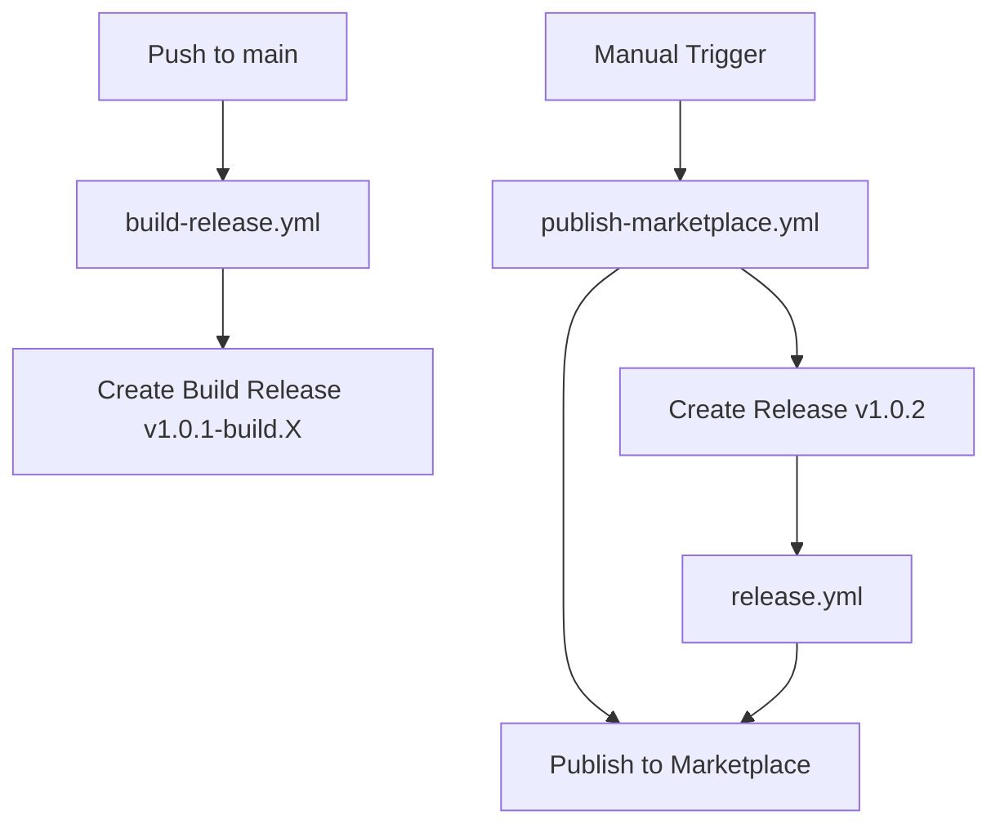

# Release Process

This document describes how releases work in the Language-Server-MCP-Bridge project.

## Release Types

### 1. Automatic Build Releases (Every Push to Main)

**Workflow**: `.github/workflows/build-release.yml`

- **Trigger**: Automatically on every push to `main` branch
- **Tag Format**: `v{version}-build.{run_number}` (e.g., `v1.0.1-build.2`)
- **Purpose**: Provides downloadable artifacts for testing/development
- **Does NOT**: Publish to VS Code Marketplace
- **Artifacts**: 
  - VSIX file attached to the GitHub release
  - Available in Actions artifacts for 90 days

**What it does:**
1. Builds and lints the extension
2. Packages the extension as `.vsix` file
3. Generates changelog from commits since last tag
4. Creates a GitHub release with the build tag
5. Uploads the `.vsix` file to the release

### 2. Marketplace Releases (Manual)

**Workflow**: `.github/workflows/publish-marketplace.yml`

- **Trigger**: Manual workflow dispatch from GitHub Actions UI
- **Tag Format**: `v{version}` (e.g., `v1.0.2`)
- **Purpose**: Official releases published to VS Code Marketplace
- **Publishes to**: 
  - VS Code Marketplace
  - Open VSX Registry (optional)

**How to create a marketplace release:**

1. Go to GitHub Actions tab
2. Select "Publish to Marketplace" workflow
3. Click "Run workflow"
4. Enter the version number (e.g., `1.0.2` - without 'v' prefix)
5. Click "Run workflow" button

**What it does:**
1. Validates version format (must be X.Y.Z)
2. Updates `package.json` with the new version
3. Builds and packages the extension
4. Creates a GitHub release with clean version tag
5. Publishes to VS Code Marketplace
6. Publishes to Open VSX Registry (if configured)

### 3. Legacy Release Hook (Kept for Compatibility)

**Workflow**: `.github/workflows/release.yml`

- **Trigger**: When a GitHub release is published (excluding build tags)
- **Purpose**: Publishes to marketplace if someone manually creates a release
- **Filter**: Ignores releases with `-build.` in the tag name

## Version Numbering

The project uses semantic versioning (semver): `MAJOR.MINOR.PATCH`

- **MAJOR**: Breaking changes
- **MINOR**: New features (backward compatible)
- **PATCH**: Bug fixes (backward compatible)

Current version is stored in `package.json` and should be updated when creating marketplace releases.

## Examples

### Testing a Feature
1. Merge PR to `main`
2. Automatic build release created: `v1.0.1-build.3`
3. Download `.vsix` from the release
4. Test locally: `code --install-extension lsp-mcp-bridge.vsix`

### Publishing a New Version
1. Decide on version number (e.g., `1.0.2` for a bug fix)
2. Go to Actions → "Publish to Marketplace"
3. Run workflow with version `1.0.2`
4. Wait for workflow to complete
5. Verify on [VS Code Marketplace](https://marketplace.visualstudio.com/items?itemName=sehejjain.lsp-mcp-bridge)

## Required Secrets

For marketplace publishing to work, the repository needs these secrets:

- `VSCE_PAT`: Personal Access Token for VS Code Marketplace
  - Get from: https://marketplace.visualstudio.com/manage
  - Required permissions: Marketplace (Publish)
  
- `OPEN_VSX_TOKEN`: (Optional) Token for Open VSX Registry
  - Get from: https://open-vsx.org/user-settings/tokens

## Troubleshooting

### Build release created but didn't trigger marketplace publish
This is expected! Build releases (with `-build.X` suffix) are NOT published to the marketplace. Use the manual "Publish to Marketplace" workflow instead.

### "Version already exists" error
The version in `package.json` matches an existing marketplace version. Increment the version number.

### Marketplace publish fails
1. Check that `VSCE_PAT` secret is set and valid
2. Verify the token has marketplace publish permissions
3. Ensure the version doesn't already exist on the marketplace
4. Check the workflow logs for specific error messages

## Workflow Dependencies

## Notes

- The deprecated `actions/create-release@v1` has been replaced with `gh release create`
- Build releases use `gh` CLI for better reliability and GitHub API v3 compatibility
- The release event trigger uses `published` instead of `created` for better reliability
- Build tags are filtered out to prevent accidental marketplace publishes
